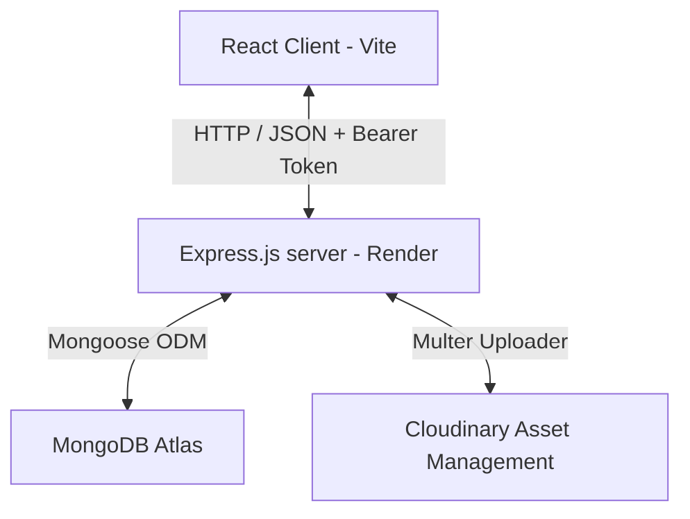

# The Crew Canvas 🎨✈️

> **Your Crew. Your Journey. One Canvas.**

[](https://opensource.org/licenses/MIT)
[](https://react.dev/)
[](https://nodejs.org/)
[](https://www.mongodb.com/cloud/atlas)
[](https://tailwindcss.com/)

**The Crew Canvas** is a collaborative group travel planning platform built using the MERN stack. Designed specifically for groups and adventure squads, it turns the chaotic process of organizing trips into a clean, shared workspace. Plan routes, finalize details via group polls, split expenses, and share trip memories all on one dynamic canvas.

---

## 🔗 Live Links

*   **Frontend URL**: [https://group-travel-itinerary-planner-one.vercel.app/](https://group-travel-itinerary-planner-one.vercel.app/)
*   **Backend URL**: [https://group-travel-itinerary-planner-plwh.onrender.com](https://group-travel-itinerary-planner-plwh.onrender.com)
*   **GitHub Repository**: [https://github.com/puish-46/Group-Travel-Itinerary-Planner](https://github.com/puish-46/Group-Travel-Itinerary-Planner)

---

## 🗺️ Architecture Overview

The application follows a decoupled client-server architecture:



-   **Frontend**: React single page application built using Vite, styled with Tailwind CSS, utilizing Zustand for centralized authentication and trip state store.
-   **Backend**: Node.js & Express REST API managing authorization middleware, group permission gates, and assets upload.
-   **Database**: Managed MongoDB Atlas instance storing collections for users, trips, itineraries, polls, expenses, and photo models.

---

## ✨ Features

-   👥 **Crew Member Management**: Add trip members securely via email. Only the creator/organizer of the trip can add new members.
-   📅 **Shared Itineraries**: Create day-by-day itineraries, add activity timelines, and let group members coordinate schedules.
-   📊 **Group Polls**: Vote democratically on trip aspects such as accommodation, travel dates, or dining choices.
-   💰 **Expense Splitter**: Log joint expenses, select specific crew members to split with, and view calculated individual equal headshares automatically.
-   📸 **Shared Memory Board**: A shared trip gallery backed by Cloudinary where members can upload and view high-quality memories from their journeys.
-   🔒 **Granular Security**: Access tokens verify logins and protect critical routes so only authenticated creators or members can view/delete specific trip details.

---

## 🛠️ Tech Stack

### Frontend
-   **React (Vite)**: Component-based UI rendering
-   **Zustand**: Lightweight, decoupled state management
-   **Axios**: Promise-based HTTP client for API interactions
-   **Tailwind CSS**: Modern utility styling configuration

### Backend
-   **Node.js & Express.js**: REST API server framework
-   **MongoDB & Mongoose**: Object Data Modeling (ODM) for database models
-   **JSON Web Token (JWT)**: Secure user session validation
-   **Cloudinary & Multer**: Processing and hosting media assets

### Infrastructure & Deployment
-   **Vercel**: High-performance frontend hosting with automatic client rewrites
-   **Render**: Managed backend service hosting
-   **MongoDB Atlas**: Distributed cloud database

---

## 📂 Folder Structure

```
GroupTravelItineraryPlanner/
├── README.md                          # Main Root Documentation
├── package.json
├── GROUP-TRAVEL-BACKEND/              # Express API Server Codebase
│   ├── APIs/                          # Express Router Controllers
│   ├── Models/                        # Mongoose Schema Definitions
│   ├── Middlewares/                   # Token Validation Interceptors
│   ├── db.js                          # Database Connection Setup
│   ├── server.js                      # Main App Server Bootstrapper
│   ├── package.json
│   └── README.md                      # Backend API Documentation
└── GROUP-TRAVEL-FRONTEND/             # Vite + React Client Codebase
    ├── public/
    ├── src/
    │   ├── components/                # View Screens & Interactive Layouts
    │   ├── store/                     # Zustand State Stores
    │   ├── App.jsx                    # Routing & Style Context Wrapper
    │   ├── index.css                  # Tailwind Theme Variables & Directives
    │   └── main.jsx                   # React Bootstrapper
    ├── vercel.json                    # Single Page App rewrite config
    ├── package.json
    └── README.md                      # Frontend Client Documentation
```

---

## 🚀 Installation & Setup

### Prerequisites
Ensure you have node installed:
-   **Node.js** (v18.0.0 or higher)
-   **npm** (v9.0.0 or higher)

### 1. Backend Configuration
1. Navigate to the backend directory:
    ```bash
    cd GROUP-TRAVEL-BACKEND
    ```
2. Install dependencies:
    ```bash
    npm install
    ```
3. Create a `.env` configuration file in the `GROUP-TRAVEL-BACKEND/` folder:
    ```env
    PORT=5000
    DB_URL=mongodb+srv://<username>:<password>@cluster.mongodb.net/TheCrewCanvas?retryWrites=true&w=majority
    JWT_SECRET=your_jwt_strong_secret_key
    CLOUDINARY_CLOUD_NAME=your_cloudinary_cloud_name
    CLOUDINARY_API_KEY=your_cloudinary_api_key
    CLOUDINARY_API_SECRET=your_cloudinary_api_secret
    ```
4. Start the development server:
    ```bash
    npm run dev
    ```

### 2. Frontend Configuration
1. Open a new terminal and navigate to the frontend directory:
    ```bash
    cd GROUP-TRAVEL-FRONTEND
    ```
2. Install dependencies:
    ```bash
    npm install
    ```
3. Create a `.env` configuration file in the `GROUP-TRAVEL-FRONTEND/` folder:
    ```env
    VITE_API_URL=http://localhost:5000
    ```
4. Start the frontend client:
    ```bash
    npm run dev
    ```
5. Open your browser to the local host address shown (usually `http://localhost:5173`).

---

## ⚙️ Environment Variables Summary

### Backend Settings
-   `PORT`: Port number the backend server listens on (e.g. `5000`).
-   `DB_URL`: The MongoDB Atlas connection string URI.
-   `JWT_SECRET`: Secret key used for signing and verifying JSON Web Tokens.
-   `CLOUDINARY_CLOUD_NAME` / `CLOUDINARY_API_KEY` / `CLOUDINARY_API_SECRET`: API credentials to connect with the Cloudinary cloud storage SDK.

### Frontend Settings
-   `VITE_API_URL`: Root base URL pointing to the active REST API server.

---

## 🖼️ Screenshots

*Placeholders for upcoming application views:*

| Landing Page | Trip Dashboard |
| :---: | :---: |
|  |  |

| Expenses & Splitter | Day-by-Day Itineraries |
| :---: | :---: |
|  |  |

---

## 🔮 Future Enhancements

-   💬 **In-App Messaging**: Real-time canvas chat box for crew members to coordinate.
-   📍 **Map & Route Integration**: Integrate Google Maps or Leaflet API to visually plan routes on the dashboard.
-   🔔 **Real-Time Notifications**: Push notifications for new expense splits, poll creations, or trip updates.
-   📴 **Offline Sync**: Enable service workers to store itineraries offline and sync changes when connection resumes.

---

## 👥 Authors

Created with ❤️ for travelers, explorers, and adventure squads.
